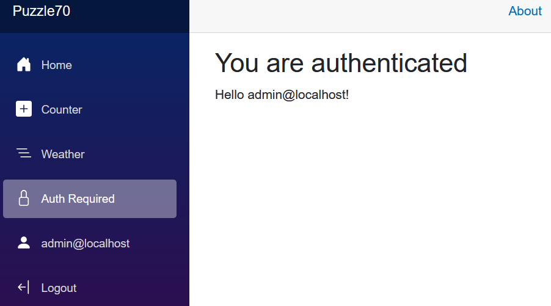
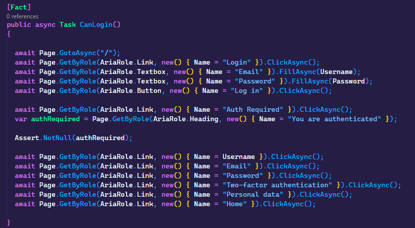

# Puzzle-70 Solving Blazor App Testing Challenges with Playwright

In Episode 70 of The Blazor Puzzle, Carl Franklin (MX) and Jeff Fritz (Microsoft) dive into integration testing in Blazor apps using Playwright. They explore how to automate UI testing, tackle authentication, and debug a tricky logout button issue. Plus, they reveal how GitHub Copilot can streamline test writing!

YouTube video: https://www.youtube.com/watch?v=WdMTp6R9WcA

Blazor Puzzle Home Page: https://blazorpuzzle.com

## The Challenge

We've been learning how to use [Playwright](https://playwright.dev) and started a new Blazor Web site with global server intereactivity.  We built a second project called `TestProject1` that contains tests written with Playwright and generated with Playwright's test generation tools as well as Copilot.

When we start the website in Puzzle70 and then attempt to run the tests in TestProject1, they throw an error when attempting to log out.  Can you review the test code and discover why?